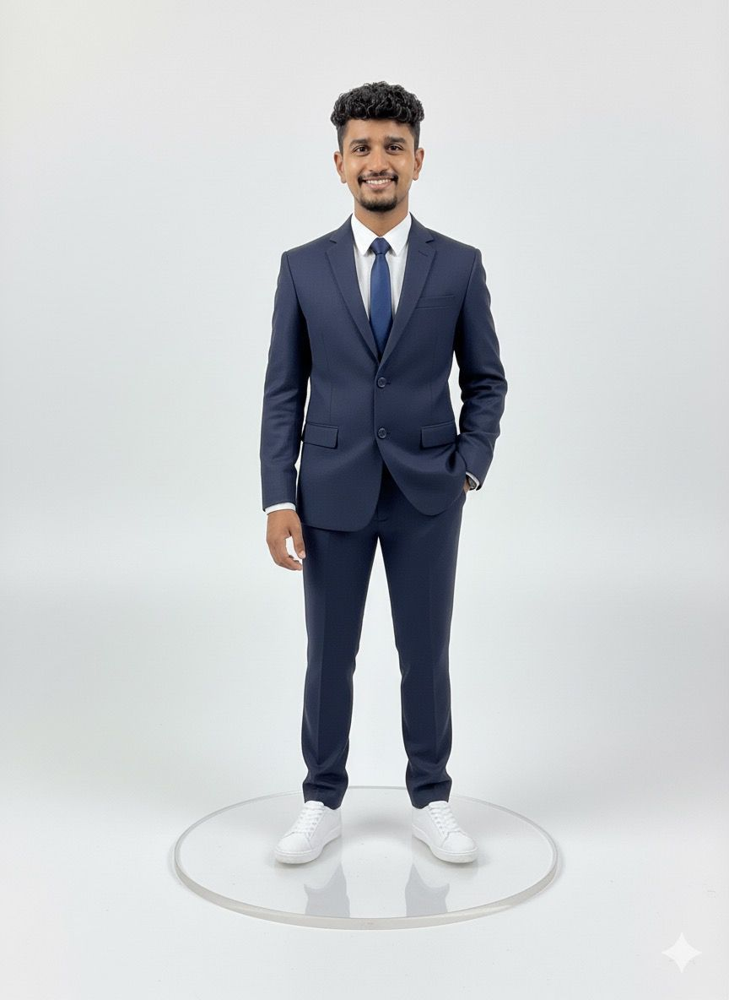

# Hi there! I'm Sourabh More 👋  

🎓 **MS CS @ Oregon State University**  
💻 **Data & Simulation Engineer | FEM Analysis | AI & Data Analytics**  
📍 Corvallis, Oregon, USA  

---

## 🚀 About Me  
I’m a data-driven problem solver currently pursuing my Master’s in Computer Science at Oregon State University.  
I’m passionate about transforming both numerical and physical data into **meaningful insights**.  

- 🔬 Experience in **Finite Element Method (FEM) simulations**, **3D modeling**, and **scientific visualization**.  
- 🛠 Skilled in **Python, Siemens NX, SQL, ParaView, Power BI, Tableau**.  
- 📊 Specialized in **Graphics, Data Visualization, AI/ML, and Topological Data Analysis (TDA)**.  
- 🌱 Actively exploring **AI-powered modeling**, **scientific visualization**, and **data engineering with a simulation edge**.  

---

## 🧑‍💻 Experience  

### Graduate Researcher – FEM & Data Analysis  
*Oregon State University (Jan 2024 – Present)*  
- Built **3D racket–shuttle impact models** in Siemens NX & Abaqus/Explicit (linear elastic, hyperelastic, viscoelastic).  
- Performed **mesh & time-step convergence studies** (<5% error thresholds).  
- Automated **stress/strain extraction, tensor analysis, and post-processing dashboards**.  
- Applied **persistence homology & Reeb graphs** to stress/strain fields; benchmarked Lp-norm features vs rebound stability.  

### Data Analyst Intern – Nirmitee Consultants  
*(Mar 2022 – May 2023)*  
- Performed **exploratory data analysis (EDA)** and **statistical modeling** for efficiency optimization.  
- Developed **Power BI dashboards** using DAX queries to visualize material usage and project metrics.  
- Implemented **data wrangling, anomaly detection, and GIS/CAD integration**.  

---

## 🛠️ Skills  

- **Programming:** Python, SQL, Java, C++  
- **Simulation & Modeling:** Siemens NX, Abaqus, ParaView, Blender  
- **Data Analytics & Visualization:** Power BI, Tableau, Matplotlib, Plotly  
- **AI & ML:** Machine Learning, TDA, Tensor Analysis  
- **Other Tools:** Git, GitHub, Jupyter, Google Colab  

---

## 📫 Connect With Me  

  
  

---
✨ *Let’s connect and collaborate on data, design, and simulations that drive real-world impact.*
